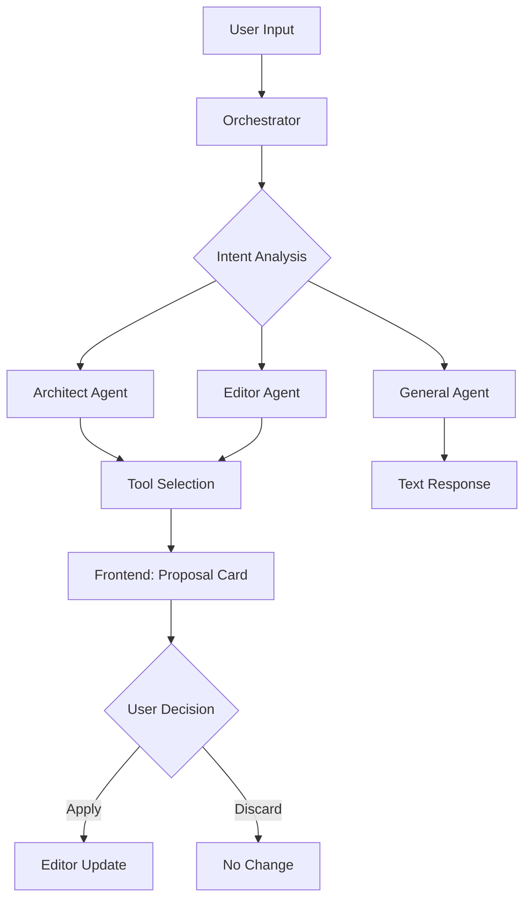

# AI Feature

Marp Web Editor の AI 機能のアーキテクチャと実装ガイド。

---

## 1. Core Concept

### 1.1 Three Personas (3つの役割)

| Persona | 役割 |
|---------|------|
| **Architect** | プレゼンテーション全体の構成設計 |
| **Editor** | スライド作成・編集・追加 |
| **General** | 会話・質問応答 |

### 1.2 Design Principles

- **Human-in-the-loop**: AI は直接編集せず、提案を行い、ユーザーが承認/却下を判断
- **Theme-Aware**: 選択中のテーマに最適化されたスライドを自動生成

---

## 2. Architecture: "Offer & Apply"

AI は **Tool Calling** を利用して変更提案（Offer）を発行し、ユーザーが承認（Apply）した時点で変更が適用されます。

### 2.1 System Flow



### 2.2 Tool Definitions

| Tool | Purpose | Human-in-the-loop |
|------|---------|-------------------|
| `propose_edit` | 既存スライドの編集提案 | ✅ Apply/Discard |
| `propose_insert` | スライドの挿入 | ✅ Apply/Discard |
| `propose_replace` | 全スライドの置換 | ✅ Apply/Discard |
| `propose_plan` | プレゼンテーション構成の提案 | 情報提示のみ |

### 2.3 Backend Structure

```
backend/src/lib/ai/
├── config.ts           # Model configuration
├── orchestrator.ts     # Intent analysis & routing
├── promptBuilder.ts    # System prompt construction
├── tools.ts            # Tool definitions
└── agents/
    ├── architect.ts    # Slide structure planning
    ├── editor.ts       # Content creation/editing
    └── general.ts      # General conversation
```

---

## 3. Tech Stack

AI SDK v5 を使用したマルチプロバイダー対応。

| Provider | Model |
|----------|-------|
| openai | gpt-4.1-mini |
| anthropic | claude-sonnet-4-20250514 |
| google | gemini-2.5-flash |
| bedrock | anthropic.claude-sonnet-4-20250514-v1:0 |

環境変数 `AI_PROVIDER` で切替可能。詳細は [ARCHITECTURE.md](./ARCHITECTURE.md#ai-integration) を参照。

---

## 4. Theme-Aware Generation

ユーザーが選択したテーマに最適化されたスライドを、追加操作なしで生成する機能。

### エージェント別のプロンプト構成

| Component | general | architect | editor |
|-----------|---------|-----------|--------|
| Agent Instructions | ✅ | ✅ | ✅ |
| Base Rules | ✅ | ✅ | ✅ |
| Theme Guidelines | ❌ | ❌ | ✅ |
| Current Context | ✅ | ✅ | ✅ |

### カスタムテーマ追加手順

1. `backend/themes/` に CSS ファイルを配置
2. `backend/guidelines/themes/` にガイドライン（.md）を作成
3. サーバー再起動

---

## 5. AI SDK v5 Critical Rules

### Rule 1: Use `toUIMessageStreamResponse()` with `useChat`

<details>
<summary>コード例</summary>

```typescript
// ✅ Correct
return result.toUIMessageStreamResponse();

// ❌ Wrong
return result.toTextStreamResponse();
```
</details>

### Rule 2: UIMessage は `parts` 配列でアクセス

<details>
<summary>コード例</summary>

```typescript
// ❌ Wrong - content は存在しない
const content = message.content;

// ✅ Correct - parts 配列からテキストを抽出
const textContent = message.parts
  .filter((part) => part.type === 'text')
  .map((part) => part.text)
  .join('');
```
</details>

### Rule 3: Use `isToolUIPart()` for Tool Detection

<details>
<summary>コード例</summary>

```typescript
import { isToolUIPart, getToolName } from 'ai';

if (isToolUIPart(part)) {
  const toolName = getToolName(part);
  // part.toolCallId, part.input, part.output, part.state
}
```
</details>

### Rule 4: Use `addToolOutput` for Human-in-the-loop

<details>
<summary>コード例</summary>

```typescript
addToolOutput({
  tool: 'propose_edit',
  toolCallId: part.toolCallId,
  output: 'Applied successfully',
});
```
</details>

### Rule 5: Agent Loop with `stopWhen`

<details>
<summary>コード例</summary>

```typescript
import { streamText, stepCountIs } from 'ai';

const result = streamText({
  model: aiModel,
  messages,
  tools: { ... },
  stopWhen: stepCountIs(5),  // 最大5ステップ
});
```
</details>

---

## 6. Usage Examples

| Intent | Input Example | Expected Output |
|--------|---------------|-----------------|
| Architect | "AIについてのプレゼンを作りたい" | propose_plan ツール呼び出し |
| Editor | "スライド2を短くして" | propose_edit ツール呼び出し |
| Editor | "スライド2の後にまとめを追加して" | propose_insert ツール呼び出し |
| Editor | "機械学習のスライドを3枚で作成して" | propose_replace ツール呼び出し |
| General | "カードレイアウトの使い方を教えて" | テキスト応答 |

---

## 7. References

- [AI SDK v5 Documentation](https://v5.ai-sdk.dev/)
- [Chatbot with useChat](https://v5.ai-sdk.dev/docs/ai-sdk-ui/chatbot)
- [Migration Guide v5.0](https://v5.ai-sdk.dev/docs/migration-guides/migration-guide-5-0)

---

## 関連ドキュメント

- [ARCHITECTURE.md](./ARCHITECTURE.md) - システム設計・技術スタック
- [DEVELOPMENT.md](./DEVELOPMENT.md) - 開発環境構築
- [DOCKER.md](./DOCKER.md) - Docker環境
